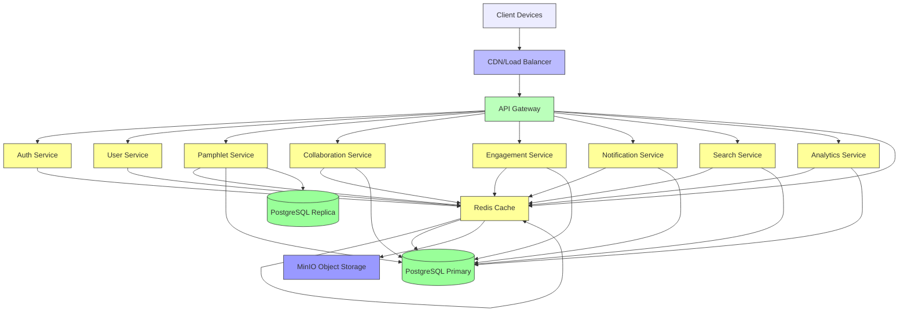

# OpenEdu Git System Architecture

## Overview

OpenEdu Git follows a modular, service-oriented architecture designed for scalability, maintainability, and security. The system is composed of loosely coupled services that communicate through well-defined APIs, enabling independent development, deployment, and scaling.

## Core Principles

1. **Separation of Concerns**: Each service has a single responsibility
2. **API-First**: All service interactions happen through documented APIs
3. **Security by Design**: Security considerations are integrated at every layer
4. **Scalability**: Horizontal scaling capabilities for handling growth
5. **Observability**: Built-in logging, monitoring, and tracing capabilities
6. **Data Privacy**: Strict adherence to data protection principles

## Architecture Layers

### 1. Presentation Layer

- **Frontend Application** (Next.js/React)
  - Server-side rendering for SEO and performance
  - TypeScript for type safety
  - Tailwind CSS for responsive, RTL-first design
  - State management with React Query and Context API
  - Accessibility compliance (WCAG 2.1 AA)

### 2. API Gateway Layer

- **Reverse Proxy** (NGINX/TRAEFIK in production)
  - SSL termination
  - Request routing
  - Rate limiting
  - CORS handling
  - Request/response logging
  - Basic DDoS protection

### 3. Application Services Layer

- **Backend API** (FastAPI/Python)
  - RESTful API design with OpenAPI 3.0 documentation
  - Async/await for high concurrency
  - Dependency injection for testability
  - Middleware for authentication, logging, error handling
  - Versioned endpoints (/api/v1/*)

### 4. Data Services Layer

- **Primary Database** (PostgreSQL 16)
  - ACID compliance for data integrity
  - JSONB for flexible metadata storage
  - Full-text search capabilities (pg_trgm, tsvector)
  - Connection pooling for efficiency
- **Object Storage** (MinIO/S3-compatible)
  - Immutable storage for handout files
  - Versioned object storage
  - Pre-signed URLs for secure access
  - Bucket lifecycle policies
- **Caching Layer** (Redis)
  - Session storage
  - Query result caching
  - Rate limiting counters
  - Pub/Sub for real-time notifications

### 5. Infrastructure Layer

- **Container Orchestration** (Docker Compose for dev, Kubernetes for prod)
- **CI/CD Pipeline** (GitHub Actions)
- **Monitoring & Logging** (Prometheus, Grafana, ELK stack)
- **Security Scanning** (Snyk, OWASP ZAP)
- **Backup & Disaster Recovery**

## Service Boundaries

### Core Services

1. **User Service**
   - Authentication (JWT, OAuth2)
   - Authorization (RBAC)
   - Profile management
   - Credential tracking
   - Expertise tagging

2. **Pamphlet Service**
   - CRUD operations for handouts
   - Version control integration
   - Metadata management
   - File storage coordination
   - Search indexing

3. **Collaboration Service**
   - Fork management
   - Merge request workflow
   - Code review system
   - Discussion threads
   - Notification system

4. **Engagement Service**
   - Ratings and reviews
   - Commenting system
   - Helpful/not helpful voting
   - Analytics aggregation

5. **Notification Service**
   - Email notifications
   - In-app notifications
   - Webhook support
   - Preference management

### Supporting Services

1. **Search Service**
   - Full-text search capabilities
   - Faceted search
   - Autocomplete/suggestions
   - Search analytics

2. **Analytics Service**
   - Usage tracking
   - Popular content metrics
   - User engagement stats
   - SEO optimization insights
   - Export capabilities

3. **Storage Service**
   - File upload validation
   - Virus scanning
   - Format conversion
   - CDN integration
   - Backup management

## API Design Principles

### RESTful Design

- Resource-oriented URLs
- Standard HTTP methods (GET, POST, PUT, PATCH, DELETE)
- Proper HTTP status codes
- Consistent response formats
- HATEOAS principles where applicable

### Versioning

- URL-based versioning (/api/v1/)
- Backward compatibility maintained within major versions
- Deprecation policy with sunset periods

### Request/Response Format

- JSON as primary data format
- Standard error response structure
- Pagination using cursor-based approach
- Filtering, sorting, and pagination parameters
- ETags for caching support

### Security Considerations

- All APIs require authentication (except public endpoints)
- HTTPS enforcement
- Input validation and sanitization
- Output encoding to prevent XSS
- CSRF protection where applicable
- Rate limiting per IP/user
- SQL injection prevention via ORM/parameterized queries
- File upload restrictions (types, size, scanning)

## Data Models

### User Model

- id (UUID)
- email (unique)
- password_hash
- full_name
- title (Mr./Ms./Dr. etc.)
- bio
- avatar_url
- is_active
- is_verified
- expertise_tags (JSONB array)
- created_at, updated_at

### Pamphlet Model

- id (UUID)
- title
- author_id (FK to users)
- grade
- subject
- chapter
- teaching_method
- difficulty_level
- is_public
- tags (JSONB array)
- created_at, updated_at

### PamphletVersion Model

- id (UUID)
- pamphlet_id (FK to pamphlets)
- version_number
- file_path (in object storage)
- file_type (pdf, tex, etc.)
- created_by (FK to users)
- created_at

### Review Model

- id (UUID)
- pamphlet_id (FK to pamphlets)
- user_id (FK to users)
- rating (1-5)
- comment
- created_at

### Fork Model

- id (UUID)
- original_pamphlet_id (FK to pamphlets)
- forked_by (FK to users)
- new_pamphlet_id (FK to pamphlets)
- created_at

### MergeRequest Model

- id (UUID)
- source_pamphlet_id (FK to pamphlets)
- target_pamphlet_id (FK to pamphlets)
- status (open, approved, rejected, merged)
- created_by (FK to users)
- reviewed_by (FK to users, nullable)
- created_at
- updated_at

## Security Architecture

### Authentication

- JWT access tokens (short-lived: 15 minutes)
- Refresh tokens (long-lived: 7 days, httpOnly cookies)
- Optional OAuth2 integration (Google, GitHub)
- Password hashing with bcrypt (cost factor 12)
- Account lockout after failed attempts
- Email verification for new accounts

### Authorization

- Role-based access control (RBAC)
- Resource-based permissions
- Owner-based access controls
- Admin/user/guest role distinctions
- Permission inheritance patterns

### Data Protection

- Encryption at rest for sensitive data
- TLS 1.3 for data in transit
- Regular security audits and penetration testing
- GDPR/CCPA compliance for user data
- Data minimization principles
- Right to be forgotten implementation

### Input Validation

- Strict schema validation for all inputs
- Whitelist approach where possible
- Length limits on all text fields
- File type validation (MIME + content inspection)
- Upload size limits (configurable per endpoint)

## Scalability Patterns

### Horizontal Scaling

- Stateless services for easy replication
- Database read replicas for query distribution
- Object storage CDN integration
- Caching layers to reduce database load
- Message queues for asynchronous processing

### Load Distribution

- Load balancers for traffic distribution
- Geographic distribution considerations
- Auto-scaling based on metrics
- Circuit breaker patterns for resilience
- Bulkhead isolation for critical services

### Database Optimization

- Connection pooling
- Read replica configuration
- Indexing strategies for query performance
- Partitioning for large tables
- Archiving strategies for historical data

## Technology Stack Justification

### Backend: FastAPI

- High performance (async capabilities)
- Automatic OpenAPI documentation
- Python ecosystem richness
- Strong typing with Pydantic
- Easy testing and maintenance

### Frontend: Next.js

- SEO-friendly server-side rendering
- Excellent developer experience
- Built-in routing and optimization
- TypeScript support
- Hybrid static/dynamic rendering
- Image optimization

### Database: PostgreSQL

- ACID compliance for financial/educational data
- Advanced JSONB capabilities
- Full-text search with language support
- Extensive extension ecosystem
- Proven scalability and reliability

### Storage: MinIO

- S3-compatible API
- Self-hosted for data sovereignty
- High performance and scalability
- Built-in encryption and versioning
- Active community and enterprise support

### Caching: Redis

- High performance in-memory store
- Rich data structures
- Persistence options
- Pub/Sub capabilities
- Wide adoption and tooling

## Deployment Architecture

### Development Environment

- Docker Compose for local development
- Hot reloading for faster iterations
- Mock services for external dependencies
- Local stack for end-to-end testing

### Staging Environment

- Kubernetes namespace
- Near-production configuration
- Automated deployment from develop branch
- Integration testing environment
- Performance testing capabilities

### Production Environment

- Kubernetes cluster with multiple node pools
- Blue-green deployment strategy
- Horizontal pod autoscaling
- Geographic load balancing
- Disaster recovery site
- Compliance monitoring and auditing

## Monitoring and Observability

### Metrics Collection

- Prometheus for time-series metrics
- Custom business metrics (user engagement, content uploads)
- Infrastructure metrics (CPU, memory, disk, network)
- Application latency and error rates
- Cache hit/miss ratios

### Logging

- Structured logging (JSON format)
- Centralized log aggregation (ELK stack)
- Log retention and archival policies
- Security event logging
- Audit trail for sensitive operations

### Tracing

- Distributed tracing with Jaeger/Tempo
- Request flow visualization
- Performance bottleneck identification
- Cross-service dependency mapping

### Alerting

- Threshold-based alerts (error rates, latency)
- Anomaly detection for unusual patterns
- Service health checks
- Capacity planning notifications
- On-call rotation integration

## Backup and Disaster Recovery

### Data Backup Strategy

- Daily incremental backups
- Weekly full backups
- Monthly archival backups
- Cross-region replication
- Point-in-time recovery capability
- Regular restore testing

### Disaster Recovery

- Recovery Time Objective (RTO): < 4 hours
- Recovery Point Objective (RPO): < 1 hour
- Automated failover mechanisms
- Regular DR drills
- Documentation and runbooks

## Future Extensibility

### Plugin Architecture

- Well-defined extension points
- Event-driven architecture for loose coupling
- Webhook support for external integrations
- API versioning for backward compatibility

### Microservices Evolution

- Service mesh for advanced traffic management
- Event sourcing for audit trails
- CQRS for read/write optimization
- Serverless functions for sporadic workloads

## Compliance and Standards

### Open Standards

- RESTful API design principles
- OpenAPI 3.0 for API documentation
- OAuth 2.0 for authorization
- OpenID Connect for authentication
- JSON Schema for validation

### Accessibility

- WCAG 2.1 AA compliance
- Screen reader support
- Keyboard navigation
- Color contrast ratios
- ARIA labels and landmarks

### Data Standards

- ISO 19115 for metadata (educational resources)
- Dublin Core for basic metadata
- Learning Resource Metadata Initiative (LRMI)
- SCORM/xAPI for e-learning compatibility

## Decision Log

### Initial Technology Choices

- **Date**: 2026-08-03
- **Decision**: Selected FastAPI/PostgreSQL/MinIO/Next.js stack
- **Rationale**: Performance, maturity, community support, alignment with educational data requirements
- **Alternatives Considered**: Django/PostgreSQL, Node.js/MongoDB, Spring Boot/MySQL

### Architecture Pattern

- **Date**: 2026-08-03
- **Decision**: Modular monolith with clear service boundaries
- **Rationale**: Simplicity for initial development, clear path to microservices evolution
- **Alternatives Considered**: Pure microservices, serverless architecture

### Database Choice

- **Date**: 2026-08-03
- **Decision**: PostgreSQL with JSONB and full-text search
- **Rationale**: ACID compliance, flexible schema, powerful search capabilities
- **Alternatives Considered**: MongoDB, Elasticsearch, MySQL

## Diagram Overview

## Next Steps

1. **API Contract Finalization**: Define exact endpoint specifications
2. **Database Migration Strategy**: Implement Alembic for schema evolution
3. **Security Implementation**: Deploy authentication and authorization mechanisms
4. **Performance Baseline**: Establish benchmarks for key operations
5. **Documentation Updates**: Maintain living architecture documentation

---
*Architecture Document v1.0 - Created 2026-08-03*
