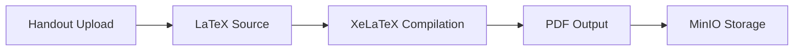
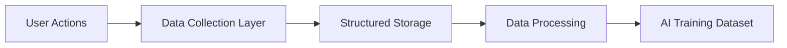

# ⚙️ OpenEdu Git Developer Guide

**Welcome to the development team!** This document will help you set up your development environment, write code, run tests, and avoid common pitfalls (especially security-related ones).

> **Our Slogan:** **"Everyone knows everything, and we decided to bring everyone together."**

---

## 🚀 Quick Start

To quickly set up the development environment using Docker Compose:

```bash
git clone https://github.com/OpenEduGit/open-edu-git.git
cd open-edu-git
docker-compose up --build
```

This command runs the `db` (PostgreSQL), `minio` (file storage), `redis` (cache and queue), `backend` (Python/FastAPI), `frontend` (Next.js), and `setup` (Minio initial configuration) services.

- **Frontend:** `http://localhost:3000`
- **Backend (API Docs):** `http://localhost:8000/docs`
- **Minio Console:** `http://localhost:9001` (User: `minioadmin`, Pass: `minioadmin` - **Development only**)

---

## ⚠️ Important Security Considerations (Especially for Production Deployment)

**This project is built with the intent of being free and secure, but the default `docker-compose.yml` is configured for development convenience and contains insecure settings for a Production environment.**

### 1. PostgreSQL Authentication Method (`POSTGRES_HOST_AUTH_METHOD: trust`)

- **Issue:** In `docker-compose.yml`, the PostgreSQL database is configured with `POSTGRES_HOST_AUTH_METHOD: trust`. This means any service that can connect to the database port can log in without a password. This is a **critical** security vulnerability for Production.
- **Recommendation:**
  - **For Production:** You must change this value to `scram-sha-256` or `md5`.
  - **Immediate Action:** When deploying to Production, ensure this value is securely set and that strong passwords are used for `POSTGRES_USER` and `POSTGRES_PASSWORD`. This parameter must not remain the default `trust` in `docker-compose.yml`.

### 2. Weak Default SECRET_KEY

- **Issue:** The `backend` service in `docker-compose.yml` uses a default and public `SECRET_KEY` (e.g., "your-secret-key-here-change-in-production"). Using a default, well-known secret key makes your application vulnerable to attacks such as session hijacking and security token manipulation. This is a **critical** security vulnerability.
- **Recommendation:**
  - **For Production:** Never use the default key. Generate a very strong, random key (at least 32 characters) and inject it securely (e.g., via Secret Management in Kubernetes or Vault).
  - **Immediate Action:** Remove the default value from `docker-compose.yml` and configure your CI/CD process to enforce the use of a randomly generated, strong secret key.

### 3. Default Minio Credentials

- **Issue:** `MINIO_ROOT_USER` and `MINIO_ROOT_PASSWORD` in `docker-compose.yml` are set to the default `minioadmin`. These credentials are **insecure** for a Production environment.
- **Recommendation:**
  - **For Production:** Never use default credentials. Generate strong, random credentials for Minio and inject them securely.
  - **Immediate Action:** Change these values for Production deployment.

### 4. Secret Management in Production

- **Issue:** `docker-compose.yml` uses environment variables with default values (`${VAR:-default}`). This approach is fine for development but insufficient for managing secrets in Production.
- **Recommendation:**
  - **For Production:** Use dedicated secret management systems (e.g., Kubernetes Secrets, HashiCorp Vault, AWS Secrets Manager).
  - **Immediate Action:** Create a `production.env.example` file to guide users in Production, which includes essential environment variables but does not contain default values.

---

## 🏗️ Project Structure

- **`frontend/`**: Frontend code (Next.js/React).
  - `src/app/`: App Router for pages and components.
  - `src/hooks/`: Reusable React hooks.
  - `src/styles/`: Global styles.
- **`backend/`**: Backend code (Python/FastAPI).
  - `app/api/`: API routes and controllers.
  - `app/core/`: Core application logic.
  - `app/db/`: Database interaction.
  - `app/models/`: SQLAlchemy models (for PostgreSQL).
  - `app/schemas/`: Pydantic models (for data validation).
  - `main.py`: FastAPI application entry point.
- **`migrations/`**: Database migration files (currently `init.sql`).
- **`scripts/`**: Utility scripts (e.g., `setup_minio_buckets.py`).
- **`tests/`**: Test code for both frontend and backend.
- **`latex-compiler/`**: Docker image for LaTeX compilation.
  - `Dockerfile`: LaTeX compiler image definition.
  - `entrypoint.sh`: Compilation entrypoint script.
- **`data/`**: Big data collection scripts and utilities (for AI training dataset).

---

## 📝 LaTeX Compilation Pipeline

### Overview

All handouts are stored as LaTeX source and compiled to PDF automatically. This ensures searchable, selectable, high-quality educational content that is preserved forever.

### Compilation Process



### Local Compilation Testing

```bash
# Test LaTeX compilation locally
cd backend
python scripts/compile_latex.py path/to/handout.tex

# With Docker
docker run --rm -v $(pwd):/compile ghcr.io/open-edu-git/latex-compiler:latest
```

### LaTeX Requirements

| Requirement | Description |
|-------------|-------------|
| **Compiler** | XeLaTeX (supports Persian fonts) |
| **Fonts** | Vazir, IranSans, Noto (for Persian text) |
| **Packages** | Full TeX Live distribution |
| **Output** | Searchable, selectable PDF with metadata |
| **Security** | Sandboxed compilation with no network access |

### Common Issues

| Issue | Solution |
|-------|----------|
| Missing fonts | Install Persian fonts (`fonts-noto`, `fonts-freefont-ttf`) |
| Encoding errors | Use UTF-8 encoding and XeLaTeX |
| Build timeouts | Increase timeout limits in CI/CD |
| Memory issues | Use smaller images or increase memory allocation |
| Persian text not rendering | Ensure XeLaTeX with proper font configuration |

### CI/CD Integration

The LaTeX compiler runs in GitHub Actions:

1. On push to `main` branch (for new versions)
2. On PDF compilation request from teacher
3. On new version creation

**GitHub Actions Workflow (`.github/workflows/compile-latex.yml`):**

```yaml
name: Compile LaTeX

on:
  push:
    paths:
      - 'pamphlets/**/*.tex'
  workflow_dispatch:
    inputs:
      pamphlet_id:
        description: 'Pamphlet ID'
        required: true
      version:
        description: 'Version'
        required: true

jobs:
  compile:
    runs-on: ubuntu-latest
    steps:
      - uses: actions/checkout@v4
      - name: Compile LaTeX
        run: |
          docker run --rm \
            -v $(pwd):/compile \
            ghcr.io/open-edu-git/latex-compiler:latest \
            pamphlet.tex
      - name: Upload PDF
        run: |
          # Upload PDF to MinIO/S3
          aws s3 cp handout.pdf s3://pamphlets/${{ inputs.pamphlet_id }}/versions/${{ inputs.version }}/pdf/
```

### Security Considerations

- **Sandboxing:** Compiler runs in isolated Docker container with no network access (except MinIO for upload).
- **Input Sanitization:** LaTeX input is sanitized to prevent malicious code execution.
- **Rate Limiting:** Max 3 PDF compilation requests per pamphlet per day.
- **Resource Limits:** CPU and memory limits enforced in Docker.

---

## 📊 Big Data Collection & AI Training Infrastructure

### Overview

The platform collects educational interactions to build the largest Iranian educational dataset for AI training.

### Data Collection Pipeline



### Data Types Collected

| Data Type | Source | Storage |
|-----------|--------|---------|
| **Handouts** | Teacher uploads | MinIO + PostgreSQL metadata |
| **Edits & Commits** | Git history | PostgreSQL (version history) |
| **Questions & Answers** | Comments, discussions | PostgreSQL |
| **Reviews & Feedback** | Rating system | PostgreSQL |
| **Teaching Methods** | Teacher profiles | PostgreSQL |

### Storage Structure

```
data/
├── raw/                    # Raw collected data
│   ├── handouts/          # LaTeX source files
│   ├── interactions/      # Q&A, comments, reviews
│   └── metadata/          # Grade, subject, content type
├── processed/             # Cleaned and structured data
│   ├── training/          # Ready for model training
│   └── validation/        # For model validation
└── scripts/               # Data processing utilities
    ├── collect_handouts.py
    ├── process_interactions.py
    └── export_for_training.py
```

### Data Privacy Rules

1. **No personal student information** is stored in training datasets
2. **All data is de-identified** before AI training
3. **Teachers consent** to data collection during registration
4. **Attribution preserved:** Teacher names are credited in the dataset
5. **Data export:** Teachers can request data export

### Local Development with Big Data

```bash
# Run data collection locally
docker-compose exec backend python scripts/collect_data.py

# Process data for AI training
docker-compose exec backend python scripts/process_for_ai.py

# Export dataset
docker-compose exec backend python scripts/export_dataset.py --format json
```

---

## 🧪 Running Tests

- **Backend (Python/FastAPI):**
  - Uses `pytest`.
  - To run tests: `docker-compose exec backend pytest /app/tests`
  - Coverage check: `docker-compose exec backend pytest --cov=app /app/tests`

- **Frontend (Next.js/React):**
  - Testing tools: Jest + React Testing Library.
  - To run tests: `docker-compose exec frontend npm test`
  - E2E tests: `docker-compose exec frontend npm run test:e2e`

- **LaTeX Compilation Tests:**
  - Test LaTeX compilation: `docker-compose exec backend python scripts/test_latex.py`
  - Validate PDF output: `docker-compose exec backend python scripts/validate_pdf.py`

**Note:** Make sure to write tests for every new feature. Test coverage should be above 80%.

---

## 📝 Coding Conventions and Guidelines

### Frontend

- Use React components and TypeScript.
- The UI must be fully RTL (right-to-left) and compatible with the Persian language.
- For styling, use Tailwind CSS (if added) or CSS Modules.
- Follow the design tokens defined in [BRAND.md](BRAND.md).
- **No inline styles** (use Tailwind classes or CSS Modules).

### Backend

- APIs must be RESTful and properly documented in Swagger (refer to `http://localhost:8000/docs`).
- Use SQLAlchemy for ORM.
- Use Pydantic for data validation.
- All functions must have type hints.
- Follow PEP 8 style guide (enforced by ruff).

### LaTeX Content

- All handouts must be available in LaTeX format.
- Use XeLaTeX with Persian font support.
- Ensure formulas are correctly rendered.
- Make text selectable and searchable in the final PDF.
- Include proper metadata (title, author, subject).

### Data Collection

- All educational interactions are collected for AI training.
- Follow privacy rules (no personal student information).
- Provide proper metadata for all content (grade, subject, content type).

---

## 🚢 Production Deployment Guide (Recommended)

**Note:** The existing `docker-compose.yml` is **NOT** suitable for Production.

### Orchestration

- For Production deployment, using Kubernetes or Docker Swarm is highly recommended to provide scalability, self-healing, and resource management.

### Secret Management

- Never place secrets (SECRET_KEY, DB/Minio/SMTP passwords) directly in Production configuration files.
- Use Kubernetes' built-in Secret Management, HashiCorp Vault, or cloud provider services.
- Generate strong random secrets for all services:

  ```bash
  # Generate a strong secret key
  openssl rand -base64 32

  # Generate database password
  openssl rand -base64 24

  # Generate MinIO credentials
  openssl rand -base64 20
  ```

### Database Migrations

- Instead of `init.sql`, use database migration tools like Alembic (for Python/SQLAlchemy) to apply schema changes in a controlled and safe manner.

### Monitoring & Logging

- Implement monitoring systems (Prometheus, Grafana) and logging stacks (ELK Stack, Loki) for Production to ensure application health and performance.
- Use Sentry for error tracking.

### Backup

- Implement regular, automated backup strategies for the database (PostgreSQL) and file storage (Minio).
- Store backups in multiple locations (off-site, cloud).

### Networking & Firewall

- Expose only the necessary ports to the internet through a Reverse Proxy/Load Balancer (e.g., Nginx, Traefik, Caddy) and configure the firewall to block other ports.
- Use HTTPS with Let's Encrypt or a commercial SSL certificate.
- Implement rate limiting and DDoS protection.

### Production Environment Variables

Create a `production.env` file with these essential variables (without default values):

```env
# Database
POSTGRES_USER=openedu_prod
POSTGRES_PASSWORD=strong-database-password
POSTGRES_DB=openedu_prod

# Backend
SECRET_KEY=very-strong-random-secret-key
DATABASE_URL=postgresql+asyncpg://user:password@db:5432/openedu_prod
MINIO_ENDPOINT=https://minio.example.com
MINIO_ROOT_USER=strong-minio-user
MINIO_ROOT_PASSWORD=strong-minio-password

# Frontend
NEXT_PUBLIC_API_URL=https://api.openedu.com
NEXT_PUBLIC_SITE_URL=https://openedu.com

# Security
CORS_ORIGINS=https://openedu.com,https://api.openedu.com
```

---

## 🗺️ Developer Roadmap

### Phase 0 – Foundation (Weeks 1-4)

- [ ] Set up GitHub repository with AGPLv3 license
- [ ] Create initial Docker Compose environment
- [ ] Set up pre-commit hooks
- [ ] Create initial database schema
- [ ] Foundational backend (FastAPI) with basic auth
- [ ] Foundational frontend (Next.js) with RTL support
- [ ] Initial LaTeX compiler Docker image

### Phase 1 – Handout Hub (Months 1-3)

- [ ] Implement user authentication (JWT, OAuth)
- [ ] Create CRUD APIs for handouts
- [ ] Implement LaTeX upload and storage
- [ ] Set up LaTeX compilation pipeline
- [ ] Implement search engine (PostgreSQL full-text)
- [ ] Build frontend for handout viewer
- [ ] Implement rating and comment system
- [ ] Implement fork/merge workflow
- [ ] Set up Big Data collection

### Phase 2 – Online Classes & Videos (Months 4-6)

- [ ] Implement WebRTC integration
- [ ] Build booking and payment system
- [ ] Create video management system
- [ ] Implement wallet and transactions

### Phase 3 – Tests & Interactive Learning (Months 7-9)

- [ ] Implement test engine
- [ ] Build visual editor for interactive lessons
- [ ] Create student progress dashboard

### Phase 4 – AI Assistant (Month 10+)

- [ ] Prepare dataset for AI training
- [ ] Fine-tune Persian language model
- [ ] Integrate AI assistant into platform
- [ ] Implement TTS integration

---

## 🔗 Related Resources

- [BRAND.md](BRAND.md) – Brand persona and values
- [CONTRIBUTING.md](CONTRIBUTING.md) – Contribution guide
- [DECISIONS.md](DECISIONS.md) – Technical and product decisions
- [RULES.md](RULES.md) – Development rules
- [ROADMAP.md](ROADMAP.md) – Project roadmap

---

> **"The best course material is built not only with collaboration, but with stable and secure code."**
> — The OpenEdu Git Team 🌱
