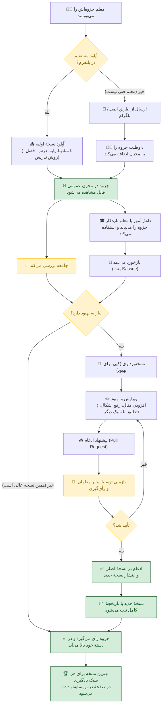
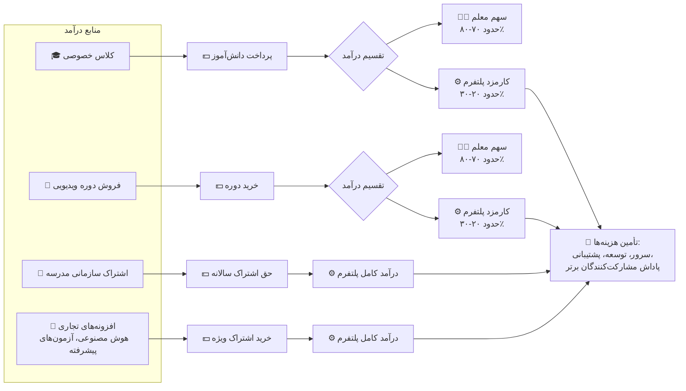
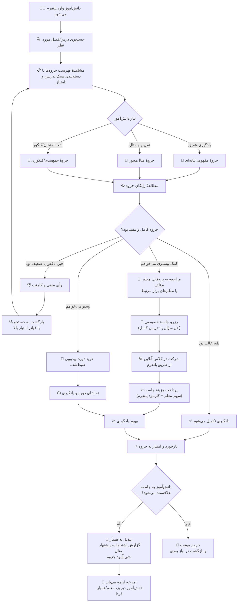
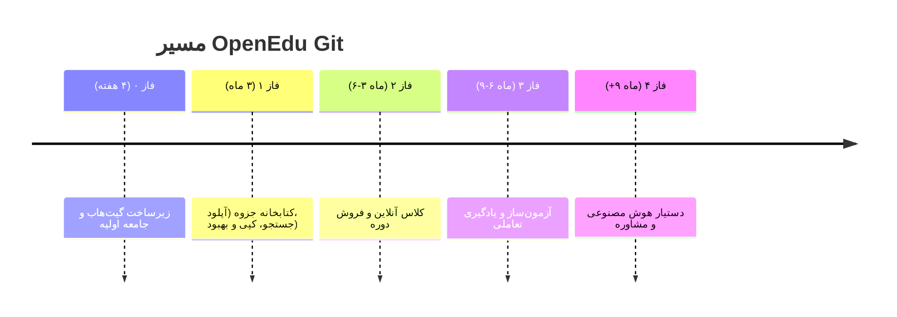

# 🌱 پلتفرم آموزشی گیت‌محور (OpenEdu Git) – نام موقت

## مرجعی آزاد برای جزوه‌ها، کلاس‌ها، آزمون‌ها و یادگیری تعاملی دروس ایران – ساخته‌شده با عشق توسط معلم‌ها و برنامه‌نویسان

[](LICENSE)

[](ROADMAP.md)

[](https://creativecommons.org/licenses/by-sa/4.0/)


[](https://t.me/OpenEduGit)

---

## 🧠 در یک نگاه (اگر فقط ۳۰ ثانیه وقت داری)

**OpenEdu Git** یک کتابخانهٔ دیجیتال زنده برای جزوه‌های درسی ایران است که معلم‌ها در آن جزوه می‌گذارند، بقیه نظر می‌دهند و آن را بهتر می‌کنند. بهترین نسخهٔ هر درس برای همه رایگان و آزاد می‌ماند، درست مثل یک گروه همکاری بزرگ معلم‌ها در سراسر کشور.

هدف، ساختن جزوه‌ای همه‌فن‌حریف از دل تجربهٔ هزاران معلم است، بدون اینکه کتاب رسمی وزارت آموزش‌وپرورش کنار گذاشته شود.

---

## 📖 واژه‌نامه کوچک (برای دوستانی که با گیت آشنا نیستند)

از آنجایی که بخشی از قدرت پلتفرم ما از دنیای نرم‌افزار و «گیت» (Git) الهام گرفته، چند واژه را خیلی ساده توضیح می‌دهیم تا همه بتوانند راحت مشارکت کنند:

- **مخزن (Repository):** همان کتابخانه یا انبار دیجیتال جزوه‌ها. جایی که فایل‌ها نگهداری می‌شوند.

- **نسخه‌برداری (Fork):** وقتی یک معلم جزوه‌ای را می‌بیند و می‌خواهد تغییری در آن بدهد، یک کپی از آن جزوه برای خودش می‌سازد. این کپی شبیه «شاخه»‌ای از درخت اصلی است.

- **پیشنهاد ادغام (Pull Request):** بعد از اینکه معلم تغییراتش را روی نسخهٔ کپی‌شده انجام داد، از صاحب نسخهٔ اصلی درخواست می‌کند که تغییراتش با نسخهٔ اصلی یکی شود.

- **بازبینی جامعه (Peer Review):** فرآیندی که در آن چند معلم دیگر تغییرات پیشنهادی را بررسی می‌کنند تا اگر اشتباه یا کم‌بودی دارد، اصلاح شود.

- **شاخهٔ اصلی (Main branch):** همان نسخهٔ اولیه و اصلی یک جزوه که همه از آن کپی می‌گیرند و بهترین تغییرات در نهایت به آن اضافه می‌شود.

اگر این واژه‌ها را به خاطر بسپارید، مشارکت در پلتفرم برایتان بسیار ساده خواهد بود.

---

## 📑 فهرست

- [هدف پروژه](#هدف-این-پروژه-چیست)

- [این پروژه برای چه کسانی است](#این-پروژه-برای-چه-کسانی-است)

- [نقش‌های مورد نیاز](#نقش‌های-مورد-نیاز-در-این-جامعه)

- [چرا این پروژه](#چرا-این-پروژه)

- [فلوچارت تولید یک جزوه](#فلوچارت-تولید-یک-جزوه)

- [پرسش‌های رایج](#پرسش‌های-رایج)

- [مدل درآمد و پایداری](#مدل-درآمد-و-پایداری)

- [چرخه دانش‌آموز در OpenEdu Git](#چرخه-دانش‌آموز-در-openedu-git)

- [ارزش‌های ما](#ارزش‌های-ما)

- [نمونه خروجی کار](#نمونه-خروجی-کار)

- [ویژگی‌های پلتفرم](#ویژگی‌های-پلتفرم-وضعیت-نهایی)

- [پشته فناوری](#پشته-فناوری-پیشنهادی)

- [شروع سریع برای مشارکت](#شروع-سریع-برای-مشارکت)

- [مجوز](#مجوز)

- [نقشه راه](#نقشه-راه)

- [درباره بنیان‌گذار](#درباره-بنیان‌گذار)

- [تماس](#تماس)

- [English Summary](#english-summary)

---

## هدف این پروژه چیست؟

من (به‌محض اضافه شدن اولین داوطلب، این کلمه با «ما» جایگزین خواهد شد) بر این باورم که «همه‌چیز را همه‌کس دانند»، پس تصمیم گرفتم بستری فراهم کنم تا همه‌کس، همهٔ آنچه می‌دانند را یک‌جا بیاورد.

هدف این پروژه تهیه و تدوین **جزوات درسی رایگان و آزاد (متن‌باز)** است. ما با تکیه بر توان و دانش جمعی قصد داریم جامعه‌ای مشارکتی برای تهیهٔ محتوای کمک‌آموزشی مناسب **طیف وسیعی از دانش‌آموزان** بر مبنای دروس وزارت آموزش و پرورش ایران بنا کنیم.

**محتواهای آزاد** یعنی هرکسی بتواند آن‌ها را استفاده کند، تغییر دهد و دوباره منتشر کند. توان جمعی یعنی جمع شدن هزاران تجربهٔ معلمی برای ساختن جزوه‌ای که واقعاً یاد بدهد.

هدف نهایی این بخش از پروژه تهیه حداقل یک جزوه کامل، آزاد و رایگان جدای هر نسخه جزوه شخصی‌سازی‌شده‌ای برای هر پایه تحصیلی و دانش‌آموز است.

---

## این پروژه برای چه کسانی است؟

اگر معلمی هستی که جزوه‌های نابش در کشوی میز خاک می‌خورند،

اگر برنامه‌نویسی هستی که دلش می‌خواهد توان‌فنی‌اش راه پرورش مهندسان فردا را هموار کند،

اگر دانش‌آموزی هستی که از پراکندگی جزوه‌ها و نبود یک توضیح خوب خسته شده‌ای،

**اینجا جای توست.**

---

## نقش‌های مورد نیاز در این جامعه

- **🧑‍🏫 معلم** – تولید جزوه، بازبینی محتوای دیگران، پاسخ به سؤالات دانش‌آموزان، برگزاری کلاس آنلاین.

- **💻 برنامه‌نویس** – توسعهٔ سکوی گیت‌محور جزوه‌ها، رابط کاربری، موتور جستجو و ابزارهای مشارکت.

- **🎓 دانش‌آموز** – استفاده از محتوا، گزارش اشتباهات، پیشنهاد بهبود و کمک به تست آزمون‌ها.

- **⌨️ تایپیست** – تبدیل جزوه‌های دست‌نویس یا اسکن‌شده به متن قابل ویرایش (Markdown یا LaTeX).

- **🎨 طراح گرافیک/تجربه کاربری** – بهبود چهرهٔ پلتفرم، رسم نمودارهای تعاملی و صفحه‌آرایی جزوه‌ها.

- ... و هرکسی که فکر می‌کند توانی برای بهتر شدن آموزش در ایران دارد.

---

## چرا این پروژه؟

تصور کن معلمی در زاهدان روشی ناب برای آموزش مشتق ابداع کرده. شاگردهایش عالی می‌فهمند، اما این روش هیچ‌وقت به کلاس بچه‌های تبریز یا اهواز نمی‌رسد.

در این پلتفرم، همان معلم جزوه‌اش را در **مخزن عمومی** قرار می‌دهد. معلمی دیگر در آن سوی کشور یک **کپی** از آن می‌گیرد و با یک مثال بومی آن را بهتر می‌کند. سپس این نسخهٔ بهبودیافته را برای ادغام با نسخهٔ اصلی **پیشنهاد** می‌دهد و پس از تأیید جامعه، ظرف چند روز هزاران دانش‌آموز به بهترین نسخه دسترسی پیدا می‌کنند.

کتاب رسمی وزارت آموزش‌وپرورش «ستون فقرات» برنامهٔ درسی ملی است؛ استاندارد، یکسان و الزامی.

اما در کلاس واقعی، هیچ دو دانش‌آموزی مثل هم یاد نمی‌گیرند. کتاب درسی به‌تنهایی پاسخگوی سرعت‌های متفاوت، شکاف‌های ذهنی، سبک‌های گوناگون یادگیری و چالش آزمون‌های سراسری و نهایی نیست.

از سوی دیگر، جزوه‌هایی که معلم‌های خلاق و باذوق در سراسر ایران می‌نویسند – پر از تشریح گام‌به‌گام، اثبات‌های بصری، مسئله‌های چالشی و قصه‌های ریاضی – در کشوی میزها خاک می‌خورند یا حداکثر در کانال‌های تلگرامی پراکنده می‌شوند.

**ایدهٔ ما:**

به‌جای آنکه هر معلم چرخ را از نو اختراع کند، یک **کتابخانهٔ دیجیتال با قابلیت ردیابی تغییرات** (شبیه به شیوهٔ برنامه‌نویسان برای همکاری روی یک پروژه) بسازیم که در آن:

- بهترین جزوه‌ها **نسخه‌بندی، بازبینی و رتبه‌بندی** شوند.

- معلم‌ها بتوانند جزوهٔ یکدیگر را **کپی کنند، بهبود دهند و برای ادغام پیشنهاد دهند**.

- جامعه‌ای زنده از مؤلفان محتوا شکل بگیرد و **جزوه‌ای همه‌فن‌حریف** از دل مشارکت جمعی متولد شود.

این پلتفرم رقیب کتاب درسی نیست؛ بلکه **لایهٔ مکلِ پویا، تعاملی و زنده‌ای** است که کتاب رسمی را برای تک‌تک دانش‌آموزان معنا می‌کند.

---

## فلوچارت تولید یک جزوه



---

## پرسش‌های رایج

### چرا کتاب رسمی را ویرایش نمی‌کنید؟

> **چون کتاب رسمی «نقشه» است، جزوه‌ها «مسیرهای رسیدن».**
>
> ۱. کتاب مشخص می‌کند **چه چیزی** باید یاد گرفته شود؛ جزوه‌ها **چگونه** یاد گرفتن را نشان می‌دهند.
> ۲. چرخهٔ بازبینی کتاب درسی ۵ تا ۷ سال طول می‌کشد – یک نوآوری در کلاس شما می‌تواند همین هفته به هزاران نفر برسد.
> ۳. یک کتاب نمی‌تواند همزمان برای دانش‌آموز قوی چالش‌برانگیز و برای دانش‌آموز ضعیف ترمیمی باشد.
> ۴. مدل همکاری و داوری جمعی ما کیفیت را تضمین می‌کند – برخلاف یک کمیتهٔ متمرکز ویراستاری.

### اگر جزوه‌ام را آپلود کنم، دیگران آن را به نام خودشان منتشر می‌کنند؟

خیر. همهٔ محتوا تحت مجوز **CC BY-SA 4.0** منتشر می‌شود. این مجوز **قانوناً** الزام می‌کند که هر استفاده یا بازنشری، نام مؤلف اصلی را به همراه داشته باشد.

گذشته از آن، تاریخچهٔ تغییرات نشان می‌دهد اولین نفری که محتوا را آپلود کرده چه کسی بوده است. شفافیت مطلق – جزوهٔ تو تا همیشه با اسم خودت می‌ماند.

### اگر معلم‌ها عمداً جزوهٔ ناقص بگذارند تا دانش‌آموز را به کلاس خصوصی هدایت کنند، چه می‌شود؟

این نگرانی کاملاً بجاست، اما سازوکار پلتفرم دقیقاً در جهت **عکس** این انگیزه طراحی شده است:

۱. **شفافیت و رتبه‌بندی عمومی:** هر جزوه بلافاصله در معرض رأی، کامنت و بازخورد جامعه قرار می‌گیرد. یک جزوهٔ ناقص یا گمراه‌کننده به سرعت امتیاز پایین می‌گیرد و در فهرست‌ها سقوط می‌کند — درست برعکس هدف معلم که می‌خواهد دیده شود.

۲. **تاریخچهٔ تغییرات و قضاوت همکاران:** همه می‌بینند چه کسی چه بخشی را نوشته یا کم گذاشته است. اگر جزوه‌ای عمداً ناقص باشد، در پیشنهادات ادغام و گزارش‌ها افشا می‌شود. این رسوایی حرفه‌ای برای یک معلم، اعتبار او را برای همیشه خدشه‌دار می‌کند.

۳. **قابلیت کپی و بهبود توسط دیگران:** حتی اگر معلمی جزوه‌اش را ناقص بگذارد، هر معلم دیگری می‌تواند یک **کپی** از آن بگیرد و بخش‌های گمشده را اضافه کند. نسخهٔ کامل‌شده با نام مؤلفان جدید (و همچنان با ذکر نام مؤلف اولیه) جایگزین نسخهٔ ناقص می‌شود. معلم اول نه تنها سودی نمی‌برد، بلکه کنترل محتوایش را نیز از دست می‌دهد.

۴. **اعتبار، نه کم‌فروشی، کلاس می‌آورد:** دانش‌آموز وقتی جزوه‌ای فوق‌العاده و کامل می‌بیند که مؤلفش مسلط و سخاوتمند است، **اعتماد** می‌کند و برای کلاس خصوصی یا دوره‌های ویدیویی همان معلم اقدام می‌کند. جزوهٔ رایگانِ قوی، **ویترین** معلم است؛ جزوهٔ ناقص، ضد‌تبلیغ.

۵. **مجوز CC BY-SA 4.0 از انحصار جلوگیری می‌کند:** اگر کسی بخواهد جزوه‌ای را «نیمه‌کاره» رها کند، جامعه اجازه دارد آن را تکمیل و با همان مجوز منتشر کند. معلم نمی‌تواند نسخهٔ ناقص را به عنوان طعمه نگه دارد و نسخهٔ کامل را فقط در کلاس خصوصی بدهد — چون هرکس نسخهٔ کامل را می‌سازد، موظف است آن را آزاد بگذارد و در نهایت آن نسخهٔ کامل به کتابخانهٔ اصلی برمی‌گردد.

**خلاصه:** در OpenEdu Git، تنها راه موفقیت تجاری برای یک معلم، **سخاوت و کیفیت** است، نه کم‌گذاری. این اقتصادِ شهرت، موتور محرک اعتماد در تمام پلتفرم‌های متن‌باز موفق بوده است.

### اگر معلم و دانش‌آموز همدیگر را در پلتفرم پیدا کنند و بعد کلاس را خارج از آن برگزار کنند تا کارمزد ندهند، چه می‌شود؟

ما به جای «گرفتن مچ»، پلتفرم را طوری طراحی می‌کنیم که **ماندن در آن برای هر دو طرف سودمندتر از دور زدن باشد**:

۱. **ارزش‌هایی که فقط داخل پلتفرم وجود دارد:** کلاس آنلاین یکپارچه با تختهٔ هوشمند، اشتراک فایل، و ضبط خودکار جلسه (که بعداً می‌تواند به فروش برسد). پرداخت امن و شفاف: پول در حساب امانی پلتفرم می‌ماند و فقط پس از برگزاری کلاس آزاد می‌شود – خیال هر دو طرف راحت است. فاکتور رسمی و تسویهٔ خودکار برای معلم‌ها.

۲. **اعتبار و بازاریابی رایگان:** هر کلاسی که روی پلتفرم برگزار شود، به امتیاز و سابقهٔ معلم اضافه می‌کند و او را در جستجوها بالاتر می‌آورد. دانش‌آموزان هم با گذاشتن بازخورد، «چهرهٔ معتمد» می‌شوند و از تخفیف‌های وفاداری بهره‌مند می‌گردند. دور زدن یعنی چشم‌پوشی از این رشد نمایی و شروع دوباره از صفر در بیرون.

۳. **ضمانت کیفیت و داوری:** اگر کلاسی خارج از پلتفرم برگزار شود و مشکلی پیش بیاید (مثلاً معلم حاضر نشود یا پول برگشت نخورد)، هیچ مرجعی برای داوری و جبران وجود ندارد. ما برای کلاس‌های داخل پلتفرم، ضمانت بازگشت وجه و تیم حل اختلاف داریم.

۴. **از دست دادن دسترسی به کل زیست‌بوم:** حساب کاربری که برای دور زدن استفاده شود (مثلاً رد و بدل کردن شماره تماس و سپس قطع ارتباط در پلتفرم) طبق قوانین ما **تعلیق** می‌شود. با تعلیق، معلم تمام جزوه‌ها، پروفایل، امتیازها و دانش‌آموزان آیندهٔ خود را از دست می‌دهد. برای معلمی که از این بستر به عنوان ویترین خود استفاده می‌کند، این هزینه‌ای بسیار گزاف است.

۵. **کارمزد منطقی:** ۲۰ تا ۳۰ درصد کارمزد در ازای خدماتی (بازاریابی، احراز هویت، زیرساخت کلاس، پیگیری حقوقی، ذخیرهٔ ابری) است که تهیهٔ تک‌تک آن‌ها برای یک معلم در بیرون بسیار دشوار و پرهزینه‌تر خواهد بود.

**خلاصه:** ما کاری می‌کنیم که برگزاری کلاس بیرون از پلتفرم، مثل «بیرون بردن غذای رستوران» بدون ظرف و چاشنی باشد – ممکن است، اما طعم و امنیت غذای داخل رستوران را ندارد و ریسکش بالاست.

### اگر مدرسه‌ای بخواهد فقط از نسخهٔ خودش استفاده کند و تغییراتش را به اشتراک نگذارد، چه می‌شود؟

> اینجا دقیقاً قدرت مجوز **AGPLv3** خودش را نشان می‌دهد.
> هر مدرسه یا مؤسسه‌ای که هستهٔ پلتفرم را روی سرور خودش اجرا کند (حتی برای استفادهٔ داخلی و اختصاصی)، **موظف است کد منبع تغییراتش را در دسترس کاربرانش قرار دهد**.
> اگر نخواهد این کار را انجام دهد، می‌تواند یک **مجوز تجاری جداگانه** از ما دریافت کند و بدون الزام به اشتراک‌گذاری تغییرات، نسخهٔ اختصاصی خود را داشته باشد.
> به این ترتیب، روح آزادی و همکاری حفظ می‌شود و در عین حال، سازمان‌هایی که نیاز به بسته‌بودن دارند، می‌توانند با حمایت مالی از پروژه، نیازشان را برطرف کنند.

### چرا یک معلم باید جزوه‌اش را رایگان در اختیار بقیه بگذارد؟

این پلتفرم یک طرفه نیست. معلم با مشارکت، **هویت حرفه‌ای و اعتبار** می‌سازد:

- برایش **پروفایل تخصصی** ساخته می‌شود که توان علمی واقعی‌اش را (از طریق مشارکت‌ها، بازخوردها و رتبه‌ها) به نمایش می‌گذارد.

- دانش‌آموزان و والدین می‌توانند بر اساس همین اعتبار، از او **درخواست کلاس خصوصی** یا مشاوره بدهند (درآمد مستقیم).

- می‌تواند **دوره‌های ویدیویی ضبط‌شده** خود را در پلتفرم بفروشد و از فروش هر دوره سهم بگیرد.

- نام و نشان او به عنوان یک مؤلف برجسته در جامعهٔ آموزشی کشور ماندگار می‌شود.

به زبان ساده: جزوهٔ رایگان، **ویترین** توانایی‌های معلم است که مشتریان واقعی (دانش‌آموزان) را به سمت خدمات پولی او هدایت می‌کند.

### جامعهٔ اولیه را چطور می‌سازید؟ هنوز که محتوایی نیست

- **بنیان‌گذار** (که خود معلم ریاضی است) اولین جزوه‌های نمونه را می‌گذارد و از دیگران دعوت می‌کند که فقط ایده بدهند، نقد کنند یا یک مثال به آن بیفزایند. مشارکت آسان شروع می‌شود.

- **جزوه‌های معلمان بازنشسته** گنجینه‌های دست‌نخورده‌ای هستند که می‌توانند با رضایت خودشان دیجیتال و آزاد شوند.

- **بازاریابی نفر‌به‌نفر** در جامعهٔ معلمان و برنامه‌نویسان: هر عضو اولیه، دو همکار خود را دعوت می‌کند.

- این پلتفرم فقط تولیدکننده جذب نمی‌کند؛ **مصرف‌کنندگان** (دانش‌آموزان و معلمان تازه‌کار که به دنبال جزوه‌های خوب می‌گردند) خودبه‌خود مراجعه می‌کنند و با دیدن رتبه‌ها و مشارکت‌ها، تشویق می‌شوند که آن‌ها هم سهمی داشته باشند.

### با تفاوت سبک‌های تدریس چه می‌کنید؟ یک جزوهٔ واحد که جواب همه را نمی‌دهد

دقیقاً به همین دلیل ما به دنبال **«بهترین نسخه» برای هر سبک یادگیری** هستیم، نه فقط یک جزوهٔ یکتا.

جزوه‌ها بر اساس **روش تدریس** دسته‌بندی می‌شوند: مفهومی، کاربردی، کنکوری/آزمونی، داستان‌محور، مثال‌محور و غیره.

معلم‌ها نیز می‌توانند تخصص خود را مشخص کنند (مثلاً «معلم مفهومی»، «معلم حل‌المسائلی»، «معلم کنکوری»).

نتیجه: دانش‌آموز برای فصل ۱ ریاضی، بسته به نیازی که دارد (یادگیری عمیق، شب امتحان، یا آمادگی کنکور) بهترین جزوهٔ متناسب با خودش را پیدا می‌کند.

هدف نهایی، **جزوه‌ای همه‌فن‌حریف** است که در دل خود مسیرهای مختلف یادگیری را پوشش دهد، نه حذف تنوع.

### وقتی محتوا زیاد شد، از کجا بفهمم کدام جزوه برای من مناسب‌تر است؟

- **دسته‌بندی دقیق** بر اساس پایه، درس، فصل، روش تدریس و سطح دشواری.

- **سیستم رتبه‌دهی و بازخورد** جامعه، بهترین‌ها را به بالای فهرست می‌آورد.

- در آینده یک **موتور پیشنهاددهنده** اضافه خواهد شد که با توجه به نیازت («برای شب امتحان»، «فقط مثال»، «اثبات قدم‌به‌قدم») و حتی سبک یادگیری‌ات، جزوهٔ مناسب را پیشنهاد کند.

---

## مدل درآمد و پایداری

این پروژه یک **کسب‌وکار اجتماعی** است، نه یک خیریهٔ بی‌بازگشت. درآمد از چند مسیر تأمین می‌شود تا پلتفرم برای همیشه رایگان و باکیفیت بماند:

- **کمیسیون اندک از کلاس‌های خصوصی:** معلم‌ها از طریق پروفایلشان شاگرد جذب می‌کنند؛ پلتفرم درصد کمی از هزینهٔ جلسات را بابت فراهم‌کردن بستر و اعتبارسنجی برمی‌دارد.

- **فروش دوره‌های ویدیویی:** معلم‌ها دوره‌های ضبط‌شده را می‌فروشند و پلتفرم کارمزد دریافت می‌کند.

- **خدمات ویژهٔ مدارس:** نسخهٔ سازمانی با امکانات مدیریتی، گزارش‌گیری و پشتیبانی اختصاصی.

- **افزونه‌های تجاری (آینده):** دستیار هوش مصنوعی، آزمون‌های پیشرفته، میزبانی ابری پرسرعت.

هستهٔ پلتفرم و تمام محتوای آموزشی **برای همیشه آزاد و رایگان** باقی می‌ماند. درآمد صرف توسعه، سرورها و حمایت از مشارکت‌کنندگان برتر می‌شود.

### جریان مالی در OpenEdu Git



---

## چرخه دانش‌آموز در OpenEdu Git



---

## ارزش‌های ما

- **آزادی و دسترسی برابر:** هر دانش‌آموزی، فارغ از شهر و هزینه، به بهترین محتوا دسترسی داشته باشد.

- **شفافیت:** فرآیند داوری و تاریخچهٔ نسخه‌ها برای همه قابل مشاهده است.

- **احترام به مالکیت فکری:** نام مؤلف همیشه کنار اثرش می‌ماند.

- **جامعه‌محوری:** بهترین محتوا از دل بحث و مشارکت جمعی بیرون می‌آید.

- **احترام به وزارت آموزش و پرورش کشور:** دستورالعمل‌های یادداشت شده و محتوای ایجاد شده هیچ تضادی با محتوای رسمی وزارت آموزش و پرورش نداشته و همواره بر اساسی بودن مطالعهٔ کتاب‌های رسمی تأکید می‌شود.

---

## نمونه خروجی کار

آیندهٔ نزدیک را ببینید. یک نمونه جزوه در پوشهٔ [`sample-pamphlets/`](./sample-pamphlets/)(به‌زودی) قرار دارد که دقیقاً مدل نهایی کار را نشان می‌دهد.

(یک اسکرین‌شات از جزوه را در [`docs/images/sample-screenshot.png`](./docs/images/sample-screenshot.png) خواهیم گذاشت – به‌زودی.)

---

## ویژگی‌های پلتفرم (وضعیت نهایی)

|وضعیت|ویژگی|

|---|---|

|🌱 فاز ۱|**کتابخانهٔ جزوه‌ها (Pamphlet Hub):** آپلود، دسته‌بندی (پایه، درس، فصل، روش تدریس)، جستجوی فارسی، رتبه‌دهی، کامنت، کپی و بهبود، و تاریخچه.|

|🌱 فاز ۱|**پروفایل معلم‌ها:** نمایش تخصص، رزومه، جزوه‌های محبوب، سبک تدریس.|

|🚀 فاز ۲|**کلاس‌های آنلاین (درخواست معلم خصوصی):** درخواست حل یک سؤال یا تشکیل کلاس خصوصی، ویدئوکنفرانس درون‌برنامه‌ای، پرداخت ریالی.|

|🚀 فاز ۲|**فروش دوره‌های ضبط‌شده:** معلم‌ها ویدیوهای آموزشی فصل‌ها را آپلود کرده و می‌فروشند.|

|🚀 فاز ۳|**برگزارکننده آزمون آنلاین:** ساخت آزمون (چهارگزینه‌ای، تشریحی)، تصحیح خودکار، آزمون‌های آزمایشی کنکور.|

|🚀 فاز ۳|**یادگیری تعاملی (سبک Brilliant):** درس‌نامه‌های قدم‌به‌قدم، کشیدن و رها کردن، نمودارهای پویا – مخصوصاً ریاضی.|

|🔮 فاز ۴|**دستیار هوش مصنوعی:** مدل زبانی آموزش‌دیده روی محتوای آموزشی ایران، پاسخ به سؤالات درسی با ارجاع به جزوه‌ها و ویدیوها.|

|🔮 فاز ۴|**مشاوره آنلاین:** ابتدا با معلم‌های واقعی، سپس به‌تدریج با هوش مصنوعی برای برنامه‌ریزی درسی.|

---

## پشته فناوری (پیشنهادی)

ما هنوز در مرحلهٔ انتخاب نهایی هستیم و **نظر تو برایمان ارزشمند است**.

اگر تجربه‌ای داری، در بخش Issues مشارکت کن.

- **فرانت‌اند:** Next.js (React) با پشتیبانی کامل RTL و فارسی

- **موبایل:** React Native (آینده)

- **بک‌اند:** Python (FastAPI) یا Node.js (NestJS) – کدام را ترجیح می‌دهی؟

- **پایگاه داده:** PostgreSQL یا MongoDB؟ منتظر رأی تو هستیم.

- **جستجو:** Elasticsearch با آنالایزر فارسی یا Meilisearch؟ تجربه‌ات را با ما به اشتراک بگذار.

- **پخش ویدیو:** CDN داخلی

- **پرداخت:** درگاه‌های شاپرکی

---

## شروع سریع برای مشارکت

### معلم عزیز، اگر با فناوری آشنا نیستی نگران نباش

ما می‌دانیم که بهترین معلم‌ها همیشه با ابزارهای فنی راحت نیستند.

برای همین یک مسیر ساده داریم:

۱. جزوه‌ات را (با ذکر نام، پایه و فصل) به ایمیل یا تلگرام ما بفرست.

۲. یا در [فرم مخصوص آپلود جزوه](https://forms.gle/WAziARJ78LHCs7cj6) (به‌زودی) ثبت کن.

۳. تیم داوطلب، جزوه‌ات را با اسم خودت به کتابخانه اضافه می‌کند.

۴. بعداً فقط کافیست نسخهٔ نهایی را بازبینی کنی – بدون نیاز به حتی یک خط کد.

📣 **همین الان دست‌به‌کار شو:** جزوه‌ات را به `mohammad.montajebii@gmail.com` بفرست تا با نام خودت در MVP اولیه حضور داشته باشی.

---

### برنامه‌نویس، محیط توسعه را در ۲ دقیقه بالا بیار

```bash

git clone https://github.com/OpenEduGit/open-edu-git.git

cd open-edu-git

docker-compose up

```

همین! حالا روی `http://localhost:3000` مرورگرت را باز کن.

جزئیات کامل در [CONTRIBUTING.md](./CONTRIBUTING.md) آمده است.

ما Issueها را با برچسب‌های `good first issue`, `help wanted`, `design` و `documentation` دسته‌بندی کرده‌ایم.

یک Issue انتخاب کن، آن را کامنت بگذار و شروع کن – ما تا ۴۸ ساعت آینده پاسخگو هستیم.

---

## مجوز

ما بین دو نوع دارایی تفاوت قائلیم: **کد پلتفرم** و **محتوای آموزشی**.

هر کدام مجوز مناسب خود را دارند تا هم آزادی بماند و هم پایداری پروژه تضمین شود.

### کد پلتفرم (هستهٔ اصلی)

تحت مجوز **[GNU Affero General Public License v3 (AGPLv3)](LICENSE)** منتشر می‌شود.

این مجوز تضمین می‌کند:

- هرکسی می‌تواند کد را ببیند، تغییر دهد و اجرا کند.

- **اگر سرویسی (حتی اینترنتی/شبکه‌ای) با این کد راه بیندازد، موظف است کد منبع تغییراتش را در دسترس کاربرانش قرار دهد.**

این یعنی هیچ‌کس نمی‌تواند هستهٔ پلتفرم را بردارد، بهبودش دهد و پشت یک سرویس بسته مخفی کند.

**این یعنی اگر مدرسه‌ای بخواهد پلتفرم را با تغییرات اختصاصی روی سرور خودش اجرا کند، *باید* کد تغییراتش را هم در دسترس بگذارد. اما اگر نخواهد این کار را بکند، می‌تواند از ما مجوز تجاری جداگانه دریافت کند (Dual Licensing) و بدون الزام به اشتراک‌گذاری، نسخهٔ اختصاصی خود را داشته باشد.**

- تو به‌عنوان صاحب اصلی پروژه، می‌توانی همین کد را با مجوزهای تجاری دیگر نیز عرضه کنی (Dual Licensing) تا افزونه‌های ویژهٔ پولی (مثل پروفایل اساتید، کلاس آنلاین، دستیار هوش مصنوعی) را روی نسخهٔ رسمی ارائه دهی.

### محتوای آموزشی (جزوه‌ها، درس‌نامه‌ها، تصاویر)

تحت مجوز **[Creative Commons Attribution-ShareAlike 4.0 International (CC BY-SA 4.0)](https://creativecommons.org/licenses/by-sa/4.0/)** باقی می‌ماند.

یعنی هرکسی می‌تواند استفاده کند، تغییر دهد و بازنشر کند، اما **حتماً نام مؤلف اصلی را بیاورد و اثر جدید نیز با همین مجوز آزاد بماند**.

این تضمین می‌کند که زحمت معلم‌ها همیشه به نام خودشان بماند و کسی نتواند آن را به شکل انحصاری تجاری کند.

### جمع‌بندی مجوزها در یک نگاه

- **کد:** AGPLv3 (آزادی + الزام بازگرداندن تغییرات در سرویس‌ها)

- **محتوا:** CC BY-SA 4.0 (آزادی + ذکر نام + حفظ آزادی)

---

## نقشه راه

جزئیات کامل در فایل [ROADMAP.md](./ROADMAP.md) قرار دارد.

خلاصهٔ مسیر پیش‌رو را در این نمودار ببین:



---

## درباره بنیان‌گذار

**محمدرضا منتجبی**

- 0 سال سابقهٔ تدریس ریاضی در مدارس دولتی و نمونهٔ ایران

- برنامه‌نویس Full-stack و عاشق نرم‌افزارهای آزاد

- باور قلبی: «بهترین آموزگار، جامعه است؛ فقط باید ابزارش را ساخت.»

- [آدرس گیت‌هاب شخصی](https://github.com/montajebii)
- [آدرس تلگرام](https://t.me/ATypicalPersianBoy)

---

## تماس

- ایمیل: `mohammad.montajebii@gmail.com`

- گیت‌هاب: [github.com/your-org/open-edu-git](https://github.com)

- گروه تلگرامی معلم‌ها و توسعه‌دهندگان: [t.me/OpenEduGit](https://t.me/your-group-link)

---

> *«به امید روزی که هیچ دانش‌آموزی به‌خاطر نبود یک توضیح خوب، از درس زده نشود.»*
> *«زیرا که بر عدالت آموزشی سوگند خورده‌ام.»*
> *– محمدرضا منتجبی، معلم ریاضی، برنامه‌نویس و بنیان‌گذار پروژه*

### با هم، جزوه‌ای زنده برای همه بسازیم

---

## English Summary

**OpenEdu Git** is an open-source, collaborative platform for Iranian school handouts (pamphlets), built by and for teachers and developers. It aims to become the free, community-curated layer of supplementary educational content that complements the official national curriculum.

- Teachers upload handouts; the community rates, reviews, and improves them.

- All content is licensed under CC BY-SA 4.0, ensuring attribution and freedom.

- The core platform is under AGPLv3, requiring any network service using it to share its modifications back.

- Future phases include live online classes, recorded courses, an exam builder, interactive lessons (like Brilliant), and an AI tutor fine-tuned on Persian educational data.

- A sustainable business model via commissions, premium school plans, and commercial add-ons keeps the core free forever.

We are currently in the pre-MVP stage, seeking pioneering teachers and developers. If you believe education should be collaborative and free, join us.
