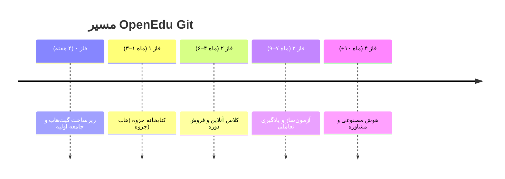

# 🗺️ نقشهٔ راه OpenEdu Git (Roadmap)

> **آخرین به‌روزرسانی:** [تاریخ امروز]  
> **وضعیت کلی پروژه:** پیش از MVP – در حال ساخت جامعهٔ اولیه و نمونهٔ نخست.

این سند مسیر حرکت پروژه از ایده تا پلتفرم کامل را نشان می‌دهد. نقشهٔ راه زنده است و با بازخورد جامعه و تغییر شرایط، به‌روز می‌شود.
ما از هر معلم، برنامه‌نویس و دانش‌آموزی دعوت می‌کنیم در شکل‌گیری این مسیر سهیم باشد.

---

## 🌱 تصویر بزرگ

ما یک **کتابخانهٔ دیجیتال زنده برای جزوه‌های درسی ایران** می‌سازیم که در آن:
- معلم‌ها جزوه می‌گذارند، بقیه نظر می‌دهند و بهترش می‌کنند (مثل همکاری روی کد).
- بهترین نسخهٔ هر درس برای همه رایگان و آزاد می‌ماند.
- به تدریج کلاس‌های آنلاین، دوره‌های ویدیویی، آزمون‌ها، آموزش تعاملی و دستیار هوش مصنوعی به آن اضافه می‌شود.

پایداری مالی پروژه از طریق **کمیسیون کلاس‌های خصوصی، فروش دوره‌ها و خدمات ویژهٔ مدارس** تأمین می‌شود، در حالی که هستهٔ پلتفرم و تمام محتوای آموزشی برای همیشه رایگان و متن‌باز (AGPLv3 / CC BY-SA 4.0) باقی می‌ماند.

---

## 📅 جدول زمانی کلی

---

## 🎯 فاز ۰ – پی‌ریزی و جذب جامعهٔ اولیه (هفته ۱ تا ۴)

**هدف:** ایجاد خانهٔ دیجیتال پروژه، آماده‌سازی حداقل محتوای نمونه، و گردآوری نخستین معلم‌ها و توسعه‌دهندگان.

### فعالیت‌های کلیدی

- [x] نوشتن README، راهنمای مشارکت و نقشهٔ راه  
- [x] ساخت سازمان و مخزن در گیت‌هاب با مجوز AGPLv3  
- [x] راه‌اندازی فرم گوگل برای دریافت جزوه از معلمان غیرفنی  
- [ ] طراحی لوگو و هویت بصری موقت (با کمک داوطلب طراح)  
- [ ] ایجاد کانال تلگرام / گروه Discussion در گیت‌هاب برای گفتگوی آزاد  
- [ ] انتشار فراخوان در شبکه‌های اجتماعی معلمان و برنامه‌نویسان  
- [ ] تهیهٔ ۲-۳ جزوهٔ نمونه (ریاضی، فیزیک، ...) توسط بنیان‌گذار و معلمان داوطلب  
- [ ] ایجاد Issueهای «دعوت به همکاری» با برچسب‌های `good first issue` و `help wanted`  
- [ ] مصاحبه با ۱۰-۱۵ معلم برای تأیید نیازها و گرفتن بازخورد از ایده  

### خروجی فاز ۰

- مخزن گیت‌هاب با مستندات کامل و جامعه‌ای ۳۰-۵۰ نفره (معلم + برنامه‌نویس + همیار)  
- حداقل ۵ جزوه در مخزن (آپلود شده از طریق فرم یا گیت)  
- شفافیت کامل در مورد مسیر پروژه و مجوزها

---

## 📚 فاز ۱ – کتابخانهٔ جزوه‌ها (هاب جزوه) | ماه ۱ تا ۳

**هدف:** راه‌اندازی وب‌سایتی که معلم‌ها بتوانند جزوه‌های خود را آپلود، دسته‌بندی، جستجو، رتبه‌بندی و با کمک یکدیگر بهبود دهند.

### ویژگی‌های اصلی پلتفرم

- ثبت‌نام / ورود (ایمیل، شماره موبایل، گوگل)
- پروفایل کاربری ساده برای معلم‌ها (نام، تخصص، بیوگرافی، جزوه‌ها)
- آپلود جزوه (PDF، Word، Markdown) با متادیتا:
  - پایه، درس، فصل، نوع جزوه (مفهومی، کنکوری، جمع‌بندی و...)، سطح دشواری
- نمایش جزوه در مرورگر (خوانندهٔ PDF و Markdown توکار)
- جستجوی تمام‌متن فارسی (Elasticsearch یا Meilisearch با تحلیلگر فارسی)
- سیستم رتبه‌دهی و کامنت (بدون نیاز به لاگین برای مشاهده، با لاگین برای رأی)
- فورک (کپی) و پیشنهاد ادغام (Pull Request) برای محتوای جزوه‌ها
- تاریخچهٔ تغییرات هر جزوه (نسخه‌بندی)
- نمایش بهترین جزوه‌ها بر اساس سبک یادگیری (فیلتر و مرتب‌سازی)
- رابط کاربری کاملاً فارسی، واکنش‌گرا (Mobile-first) و با پشتیبانی RTL

### کارهای فنی (Backend / Frontend)

- [ ] تصمیم‌گیری نهایی پشتهٔ فناوری: انتخاب بین FastAPI / NestJS و PostgreSQL / MongoDB (با رأی‌گیری جامعه)
- [ ] پیاده‌سازی احراز هویت (JWT, OAuth)
- [ ] طراحی مدل داده برای کاربران، جزوه‌ها، نسخه‌ها و بازخوردها
- [ ] راه‌اندازی MinIO یا S3 داخلی برای ذخیرهٔ فایل‌ها
- [ ] ایجاد API های CRUD جزوه و نسخه‌بندی
- [ ] پیاده‌سازی موتور جستجو با پشتیبانی از حروف فارسی
- [ ] ساخت رابط کاربری با Next.js (React) + Tailwind
- [ ] تست با داده‌های واقعی (جزوه‌های جمع‌آوری‌شده)

### فعالیت‌های جامعه

- [ ] دعوت مستمر معلمان برای آپلود جزوه و بازخورد
- [ ] برگزاری رویدادهای کوچک آنلاین "جزوه‌نویسی جمعی" (مثلاً کامل کردن یک فصل خالی)
- [ ] تشویق برنامه‌نویسان به مشارکت در Issue های `good first issue`
- [ ] همکاری با کانال‌های آموزشی و معلم‌های تأثیرگذار برای معرفی

### خروجی فاز ۱

- نسخهٔ زندهٔ وب‌سایت روی دامنهٔ ایرانی (یا فعلاً Vercel/Netlify با آینهٔ داخلی)
- حداقل ۱۰۰ جزوه با کیفیت در موضوعات مختلف
- ۲۰۰ کاربر ثبت‌نام‌کرده و مشارکت فعال (کامنت، رأی، فورک)
- اولین حلقهٔ بستهٔ «همکاری جمعی»: جزوه‌ای که چند معلم روی آن کار کرده‌اند و تاریخچه‌اش شفاف است.

---

## 👨‍🏫 فاز ۲ – کلاس‌های آنلاین و دوره‌های ویدیویی | ماه ۴ تا ۶

**هدف:** تبدیل پروفایل معلمان به یک بازارچهٔ تدریس. دانش‌آموز بتواند مستقیماً از همان معلمی که جزوه‌اش را دیده، کلاس خصوصی رزرو کند یا دورهٔ ضبط‌شده بخرد. درآمدزایی آغاز می‌شود.

### ویژگی‌های جدید

- تقویم و زمان‌بندی در پروفایل معلم (تعیین ساعات آزاد و نرخ هر جلسه)
- سیستم رزرو و پرداخت: «درخواست حل یک سؤال» یا «جلسهٔ تدریس کامل»
- کلاس درس آنلاین یکپارچه (WebRTC) با:
  - تختهٔ سفید تعاملی
  - اشتراک فایل و صفحه
  - ضبط خودکار جلسه (با اجازهٔ طرفین)
  - چت متنی
- کیف پول و سیستم پرداخت ریالی (درگاه شاپرکی: Zarinpal و...)
- کمیسیون خودکار: مثلاً ۲۰٪ برای پلتفرم، ۸۰٪ برای معلم (تسویهٔ منظم)
- فروشگاه دوره‌های ویدیویی:
  - آپلود ویدیو (ارتباط با CDN داخلی مثل ArvanCloud)
  - قیمت‌گذاری توسط معلم
  - خرید و دسترسی مادام‌العمر برای دانش‌آموز
- امتیازدهی و بازخورد برای کلاس‌ها و دوره‌ها

### کارهای فنی

- [ ] یکپارچه‌سازی WebRTC (استفاده از Jitsi یا پیاده‌سازی سفارشی با mediasoup)
- [ ] پیاده‌سازی گردش کار رزرو و پرداخت (وب‌هوک درگاه)
- [ ] ساخت سامانهٔ مدیریت و پخش ویدیو (HLS با محافظت لینک)
- [ ] ایجاد کیف پول، تراکنش‌ها و صورتحساب
- [ ] رعایت الزامات قانونی (احراز هویت معلم، فاکتور، e-namad)

### فعالیت‌های جامعه

- [ ] جذب معلمانی که مایل به تدریس خصوصی آنلاین هستند
- [ ] برگزاری چند کلاس رایگان نمونه برای جلب اعتماد
- [ ] بازاریابی دانش‌آموزی (از طریق مدارس، کانال‌ها)

### خروجی فاز ۲

- فعال شدن جریان درآمد واقعی (حتی با ۲۰-۳۰ معلم و چند صد دانش‌آموز)
- اثبات مدل اقتصادی «جزوهٔ رایگان → اعتبار → درآمد از کلاس»
- بستر کلاس اختصاصی که وابسته به سرویس‌های خارجی تحریم‌پذیر نیست.

---

## 📝 فاز ۳ – آزمون‌ساز و یادگیری تعاملی | ماه ۷ تا ۹

**هدف:** تعمیق یادگیری با محتوای تعاملی شبیه Brilliant و امکان برگزاری آزمون‌های آنلاین استاندارد. جذب دانش‌آموزان برای تمرین و سنجش.

### ویژگی‌ها

- **آزمون‌ساز آنلاین:**
  - ساخت سؤالات چهارگزینه‌ای، تشریحی، جای‌خالی و وصل‌کردنی
  - تصحیح خودکار سؤالات عینی + ابزار تصحیح دستی برای تشریحی
  - زمان‌بندی و تنظیمات امنیتی (عدم خروج از صفحه، دور زدن ممنوع)
  - امکان فروش «آزمون‌های آزمایشی» شبیه‌ساز کنکور / امتحان نهایی
- **درس‌نامه‌های تعاملی (Brilliant-style):**
  - موتور تعاملی مبتنی بر قدم‌های کوچک (Step-by-step)
  - المان‌های کشیدنی (Drag & Drop)، نمودارهای پویا (با D3.js یا Canvas)
  - مسیرهای انشعابی: بسته به پاسخ دانش‌آموز، توضیح متفاوت داده می‌شود.
  - ابزار سازندهٔ درس برای معلمان (بدون نیاز به کدنویسی، مثل Scratch blocks)
- **داشبورد پیشرفت دانش‌آموز** (نقشهٔ دانش، گزارش عملکرد)

### کارهای فنی

- [ ] طراحی و پیاده‌سازی موتور آزمون و بانک سؤالات
- [ ] ساخت ویرایشگر بصری درس‌های تعاملی
- [ ] پیاده‌سازی رندرر تعاملی با React (مدیریت state گام‌ها)
- [ ] گسترش API و پایگاه داده برای آزمون‌ها و مسیرهای یادگیری

### خروجی فاز ۳

- وجود ۲۰-۳۰ درس تعاملی (عمدتاً ریاضی و علوم) که معلمان ساخته‌اند.
- امکان برگزاری آزمون‌های سراسری توسط معلمان و مدارس.
- افزایش چشمگیر ماندگاری کاربران (از مصرف‌کنندهٔ محتوا به یادگیرندهٔ فعال).

---

## 🤖 فاز ۴ – هوش مصنوعی و مشاوره | ماه ۱۰ به بعد

**هدف:** استفاده از داده‌های آموزشی جمع‌آوری‌شده (جزوه‌ها، سؤالات، بازخوردها) برای ساخت یک دستیار هوش مصنوعی فارسی‌زبان که به سؤالات درسی پاسخ دهد، و بعداً مشاورهٔ تحصیلی شخصی ارائه کند.

### ویژگی‌های برنامه‌ریزی‌شده

- **دستیار هوش مصنوعی درسی:**
  - Fine-tuning یک مدل زبانی باز فارسی (مانند Llama-3 یا PersianLLaMA) روی پیکرهٔ آموزشی پروژه.
  - قابلیت پاسخ‌گویی به سؤالات درسی با ارجاع به جزوه‌ها، ویدیوها و تمرین‌ها.
  - سیستم «پاسخ با قطعیت»: اگر مطمئن نیست، سؤال را به معلم انسانی ارجاع می‌دهد (Human-in-the-loop).
  - یکپارچه‌سازی در پلتفرم: در کنار هر جزوه، یک چت‌بات بگوید «سؤال بپرس».
- **مشاورهٔ تحصیلی آنلاین:**
  - فاز انسانی: رزرو جلسه با مشاوران متخصص (با نرخ و امتیاز).
  - فاز AI: مدل اختصاصی که با توجه به عملکرد دانش‌آموز در آزمون‌ها و تعاملات، برنامهٔ مطالعاتی و نقاط ضعف را پیشنهاد کند.
- **تولید محتوای هوشمند:** کمک به معلمان در تولید پیش‌نویس جزوه، تبدیل دست‌نویس به متن، یا پیشنهاد مثال.

### پیش‌نیازها

- حجم قابل توجه دادهٔ ساختاریافته (چند هزار جزوه، صدها هزار پرسش و پاسخ، رونوشت کلاس‌ها) که در فازهای قبل جمع شده است.
- زیرساخت پردازشی (GPU)؛ احتمالاً در ابتدا استفاده از سرویس‌های ابری داخلی یا بین‌المللی.

### خروجی فاز ۴

- یک دستیار آموزشی که دانش‌آموزان بتوانند در هر لحظه از آن کمک بگیرند.
- سامانهٔ مشاورهٔ مبتنی بر داده که نرخ موفقیت تحصیلی را افزایش دهد.
- تثبیت OpenEdu Git به‌عنوان پلتفرم جامع یادگیری ایران.

---

## 🧭 فراتر از فاز ۴ (افق‌های بلندمدت)

- اپلیکیشن موبایل بومی (React Native / Flutter) با تجربهٔ کاملاً آفلاین‌دوست.
- امکان خودانتشاری (Self-hosting) آسان برای مدارس (یک کلیک نصب روی سرور مدرسه).
- ادغام با سیستم‌های رسمی (در صورت تمایل آموزش‌وپرورش).
- شبکهٔ اجتماعی معلمان ایران (جامعهٔ حرفه‌ای).

---

## 🤝 مشارکت در این نقشهٔ راه

اگر ایده‌ای داری، نکتۀ فنی به ذهنت رسیده، یا می‌خواهی یک فاز را زودتر جلو ببری:

- یک Issue جدید در گیت‌هاب باز کن.
- در [بخش گفتگوها](https://github.com/OpenEduGit/open-edu-git/discussions) نظرت را بگو.
- یا مستقیم به ایمیل `mohammad.montajebii@gmail.com` پیام بده.

این نقشه با هم بهتر می‌شود. قدم بعدی را با هم برداریم 🌱
